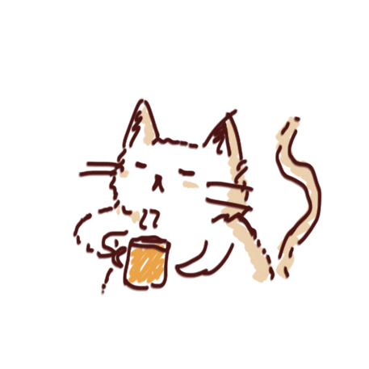

## 👋 Hi there, I'm Leo
- 👨‍🎓 Computer engineering student
- ☀️ Google Summer of Code 2021 student
    - [Check out my project here!](https://gist.github.com/leoruas/ec2de571a1ba8f61858eaf38baf2f800)

## 🐱‍👤 Skills

    
    
    
    
    
    
    
    
    
    
    
    
    

## 🌐 Find me at

    
    
